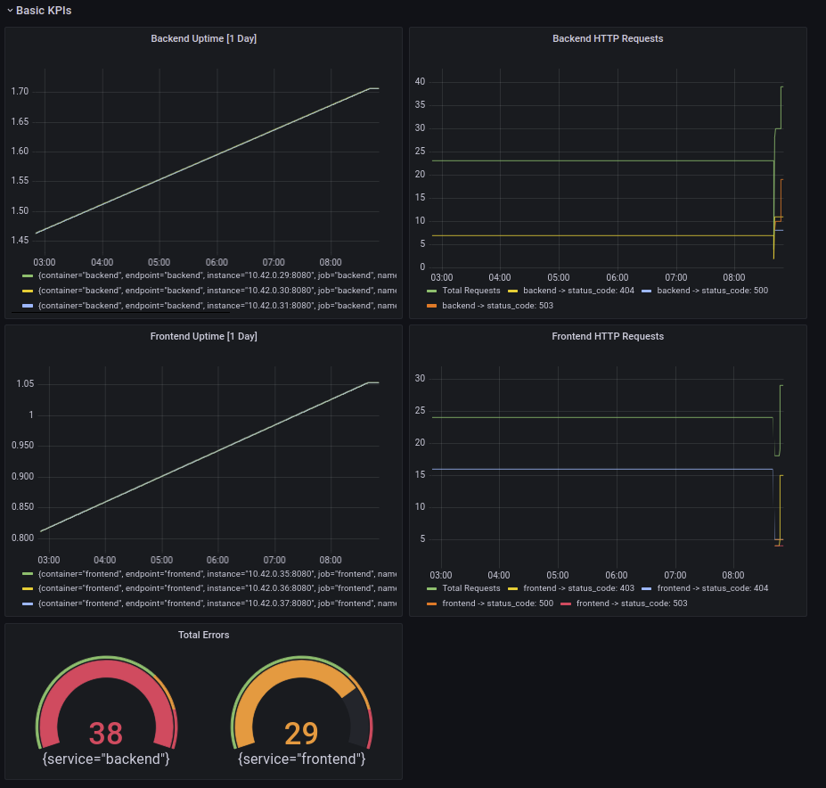

**Note:** For the screenshots, you can store all of your answer images in the `answer-img` directory.

## Verify the monitoring installation


## Setup the Jaeger and Prometheus source


## Create a Basic Dashboard


## Describe SLO/SLI

An SLI (Service Level Indicator) is the actual metric used to track if a service is meeting it's SLO (Service Level Objective).  The SLI is the actual result against the SLO.

Example SLO: *Monthly uptime of 95%*

**SLI**: Display running monthly uptime in a dashboard panel

Example SLO: *Average Monthly Request Response Time of < 250ms*

**SLI**: Average monthly request response time in a dashboard panel

>Once you know the SLOs, you'll use a dashboard to make your status against that objective on a continuous basis.  The actual value from the dashboard is your current indicator against that objective.

## Creating SLI metrics

> In the first review, the reviewer (and the rubric) said these should be KPIs, even though the README template says these should be SLIs.  Not having the README connected to the rubric meant the project review will almost never go well.

|Metric|Description|
|---|---|
|Frontend Uptime|Running total of uptime for our Frontend Service for the current month|
|Backend Uptime|Running total of uptime for our Backend Service for the current month|
|Frontend Failing Requests by type|Number of Frontend requests that have an error (40x & 50x)|
|Backend Failing Requests by type|Percentage of Backend requests that have an error (40x & 50x)|
|Total Errors|Total combined errors between the frontend and backend service|

## Create a Dashboard to measure our SLIs



## Tracing our Flask App


**Python Trace Example**

```python
from flask import Flask, jsonify, render_template
from flask_opentracing import FlaskTracing
from jaeger_client import Config
from jaeger_client.metrics.prometheus import PrometheusMetricsFactory
from opentelemetry.instrumentation.flask import FlaskInstrumentor
from opentelemetry.instrumentation.requests import RequestsInstrumentor
from prometheus_flask_exporter import PrometheusMetrics


app = Flask(__name__)
FlaskInstrumentor().instrument_app(app)
RequestsInstrumentor().instrument()

metrics = PrometheusMetrics(app)
metrics.info("appInfo", "Trial App", version="0.0.1")
logging.getLogger("").handlers = []
logging.basicConfig(format="%(message)s", level=logging.DEBUG)
logger = logging.getLogger(__name__)


def init_tracer(service):

    config = Config(
        config={
            "sampler": {"type": "const", "param": 1},
            "logging": True,
            "reporter_batch_size": 1,
        },
        service_name=service,
        validate=True,
        metrics_factory=PrometheusMetricsFactory(service_name_label=service),
    )

    # this call also sets opentracing.tracer
    return config.initialize_tracer()


tracer = init_tracer("trial")
flask_tracer = FlaskTracing(tracer, True, app)


@app.route("/")
@tracing.trace()
def homepage():
    return render_template("main.html")
```

## Jaeger in Dashboards


## Report Error

```markdown
# TROUBLE TICKET

Name: Josh Haines

Date: 11Feb2022

Subject: Strange 503 error on UdaConnect `Trial` Service

Affected Area: `/trace` endpoint

Severity: Medium

Description: We're watching the dashboard carefully and noticing a sporadic error in the
 `trial` service.  You can see an example with the span ID `8e2db9bd4a0dee06`. Thanks!
```


## Creating SLIs and SLOs

>Note: The Readme doesn't ask for 4 SLOs, just 1 SLO which is provided, then asks us to create 4 SLIs based on it.  There is nothing in the class, nor in the rubric, nor in the Readme about `golden signals`.  Please don't make up tasks and expect them to be in the project...we can't read the mind of each reviewer.  The task in the original readme reads: `We want to create an SLO guaranteeing that our application has a 99.95% uptime per month. Name four SLIs that you would use to measure the success of this SLO.`

SLO: 99.95% Uptime per month

- Latency - overall response time, usually in ms
- Error Rates - Total requests and error requests
- Rates - Total requests, often in req/sec
- Utilization or Consumption (resource usage - CPU, Memory, etc.)

## Building KPIs for our plan

By mixing our SLIs, SLOs, and metrics which are capable of being displayed, I feel the following list of dashboard items will be the most useful in helping us to manage these applications.

- Latency
  - Avg Response Frontend
  - Avg Response Backend
- Error Rates
  - Backend Error Requests
  - Frontend Error Requests
- Rates
  - Backend Total Requests
  - Frontend Total Requests
- Utilization
  - CPU Usage
  - Bandwidth Transmitted & Received by Container

## Final Dashboard

Dashboard Description:

- Avg Response times of the frontend and backend services to see how the overall speed is doing
- Total number of errored requests as a quick gauge chart
- Total Backend Requests (green line) compared to number of error requests
- Total Frontend Requests (green line) compared to number of error requests
- CPU Usage across the cluster
- Container Transmitted & Received Bandwidth


