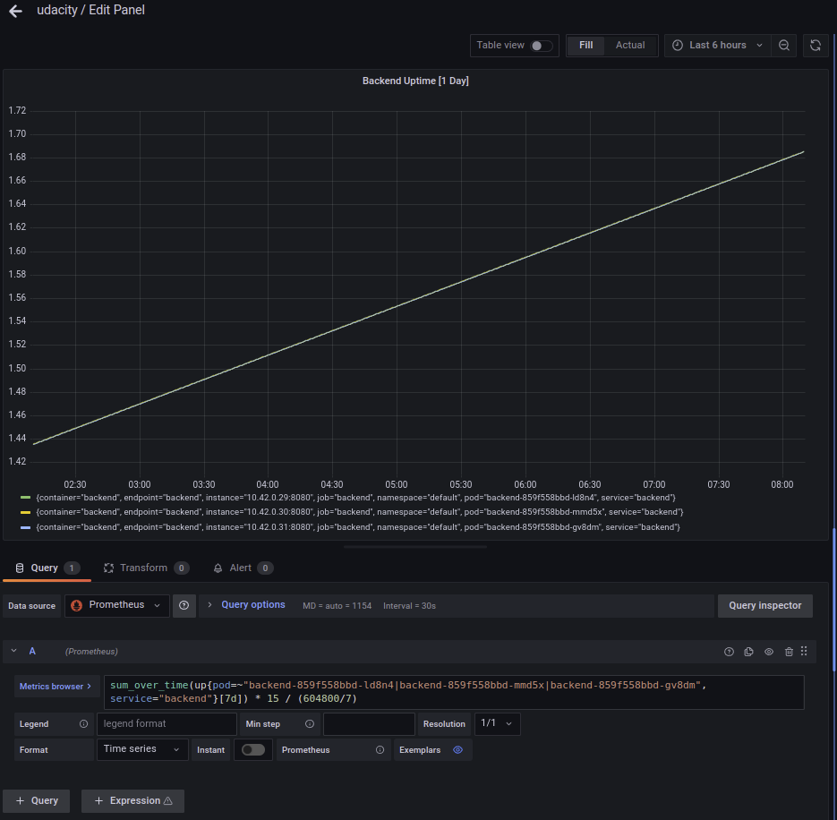
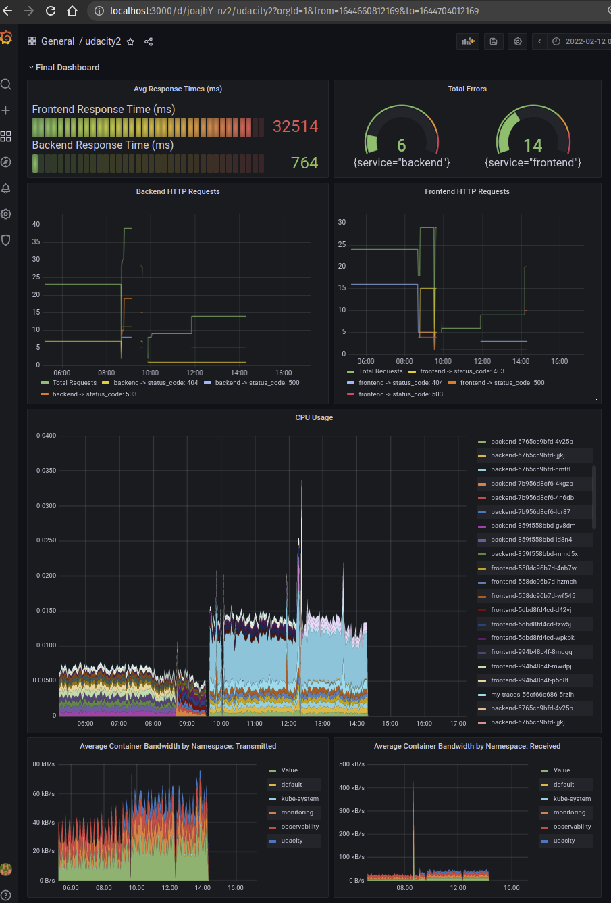

**Note:** For the screenshots, you can store all of your answer images in the `answer-img` directory.

## Verify the monitoring installation


## Setup the Jaeger and Prometheus source


## Create a Basic Dashboard



## Describe SLO/SLI

An SLI (Service Level Indicator) is the actual metric used to track if a service is meeting it's SLO (Service Level Objective).  The SLI is the actual result against the SLO.

Example SLO: *Monthly uptime of 95%*

**SLI**: Display running monthly uptime in a dashboard panel

Example SLO: *Average Monthly Request Response Time of < 250ms*

**SLI**: Average monthly request response time in a dashboard panel

>Once you know the SLOs, you'll use a dashboard to make your status against that objective on a continuous basis.  The actual value from the dashboard is your current indicator against that objective.

## Creating SLI metrics

|Metric|Description|
|---|---|
|Frontend Uptime|Running total of uptime for our Frontend Service for the current month|
|Backend Uptime|Running total of uptime for our Backend Service for the current month|
|Frontend Error Rate|Percentage of Frontend requests that have an error (40x & 50x)|
|Backend Error Rate|Percentage of Backend requests that have an error (40x & 50x)|
|Total Errors|Total combined errors between the frontend and backend service|

## Create a Dashboard to measure our SLIs


## Tracing our Flask App


**Python Trace Example**

```python
from flask import Flask, jsonify, render_template
from flask_opentracing import FlaskTracing
from jaeger_client import Config
from jaeger_client.metrics.prometheus import PrometheusMetricsFactory
from opentelemetry.instrumentation.flask import FlaskInstrumentor
from opentelemetry.instrumentation.requests import RequestsInstrumentor
from prometheus_flask_exporter import PrometheusMetrics


app = Flask(__name__)
FlaskInstrumentor().instrument_app(app)
RequestsInstrumentor().instrument()

metrics = PrometheusMetrics(app)
metrics.info("appInfo", "Trial App", version="0.0.1")
logging.getLogger("").handlers = []
logging.basicConfig(format="%(message)s", level=logging.DEBUG)
logger = logging.getLogger(__name__)


def init_tracer(service):

    config = Config(
        config={
            "sampler": {"type": "const", "param": 1},
            "logging": True,
            "reporter_batch_size": 1,
        },
        service_name=service,
        validate=True,
        metrics_factory=PrometheusMetricsFactory(service_name_label=service),
    )

    # this call also sets opentracing.tracer
    return config.initialize_tracer()


tracer = init_tracer("trial")
flask_tracer = FlaskTracing(tracer, True, app)


@app.route("/")
@tracing.trace()
def homepage():
    return render_template("main.html")
```

## Jaeger in Dashboards


## Report Error

```markdown
# TROUBLE TICKET

Name: Josh Haines

Date: 11Feb2022

Subject: Strange 40x error on UdaConnect App

Affected Area: Backend

Severity: Medium

Description: We're watching the dashboard carefully and noticing an increasing number of 40x
(primarily 404) errors on the backend service for our UdaConnect app. Could your SRE team
take a look at this when you get a minute?  Thanks!
```


## Creating SLIs and SLOs

SLO: 99.95% Uptime per month

- Average CPU usage should be less than 75% throughout the month.
- Maximum CPU usage should be less than 90% throughout the month.
- Latency should remain below 400ms for all requests throughout the month.
- Bandwith should remain below 70% saturation throughout the month

## Building KPIs for our plan

By mixing our SLIs, SLOs, and metrics which are capable of being displayed, I feel the following list of dashboard items will be the most useful in helping us to manage these applications.

- Average CPU Usage by Pod
- Average Throughput by Namespace
- Average Bandwidth by Namespace (Transmitted & Received)
- Backend & Frontend Uptime
- Backend & Frontend HTTP Requests (Total & Errors)
- Total Traces by Service (Frontend & Backend)

## Final Dashboard


